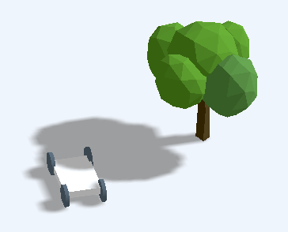

# web-sim-racing
Mini racing game which runs on browser.

## How to run?
1. You need python3 to run *server.py* using this command. (Double clicking index.html wouldn't work because, the browser doesn't allow loading multiple non-built js files -- if only i understand correctly)

        python3 server.py
    Alternatively, you could use http-server to simulate web-server by installing from npm

        npm install http-server -g
    then, run the server with this command

        http-server . -p 8000
1. Open your browser on incognito tab. A normal web browser tab would cache everything and you would need ctrl+shift+R anytime you want to reload.
1. Car control using key W, A, S, D on the keyboard
1. Modify code in **main.js**

## Development progress
- To do
- 22/7/2020 
    - Collision detection between car and tree
    - Setup development server to allow javascript 'import' keyword
    - Load .gltf model and cast shadow

    
- 21/7/2020
    - Model car accelation / steering control using bicycle model
    - Cast the shadow on the floor

## Tip and Tricks
- These 2 lines make things beautiful

        renderer.gammaOutput = true
        renderer.gammaFactor = 2.2

## Credits
[Danupolbig](https://bitbucket.org/danupolbig/) for CG matters and `server.py`